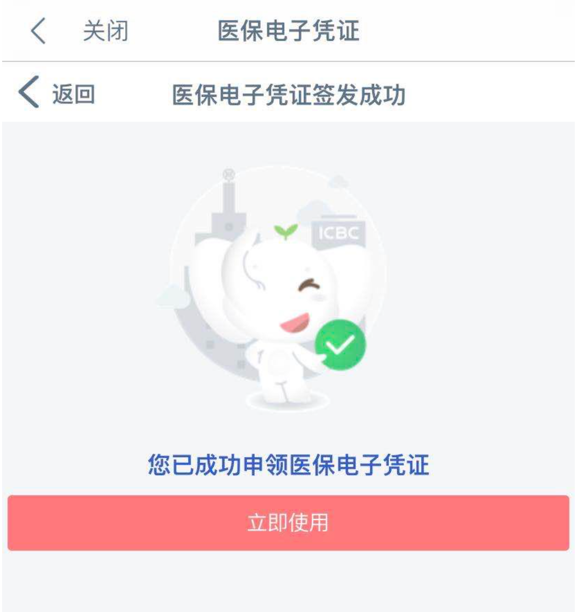
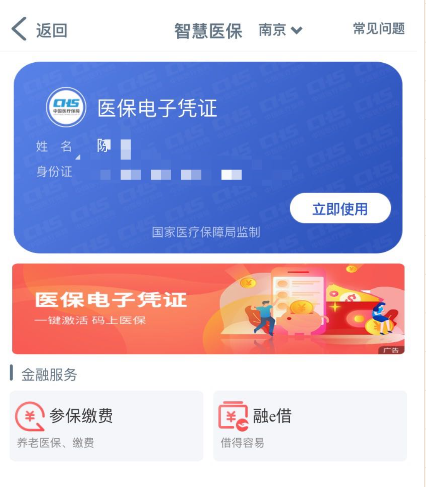

【需要“中国工商银行”app，用时约2分钟，红包每人10元】

这边工商银行在推广医保电子凭证，具体步骤：

1. 使用工商银行app扫描二维码。

备注：因为只需要一定的人数，为了防止有人做完才发现人数已经够了，请先联系我，我给你发二维码…多线程变成单线程，嘿嘿。

【联系方式】

telegram：ershierdu

微信：ekfi123

qq: 2369013527

2. 根据页面填写信息，到达以下界面，**此时还未完成**，请点击页面中的“立即使用”，然后设置密码、选择参保地。

3. 密码和参保地设置后，即完成。请截一张类似下图的图片发给我（个人信息都可以打码，留个姓氏用于统计即可）。

备注：
1、所有操作均在工商银行app内完成，请放心个人信息安全。
2、仅为推广该功能，电子凭证由国家医保信息平台生成，不会有其他影响。医保电子凭证的相关介绍可在互联网查询到。